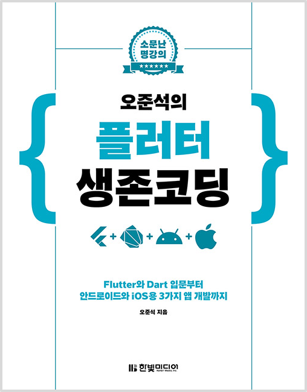

<!-- PROJECT LOGO -->
 

  
  <h3>오준석의 플러터 생존 코딩</h3>
  <small>✍ Written by <b>오준석</b></small>
   
  <small>📆 Studying <b>2020.07 ~ ing</b></small>

 

## 📄 리뷰

(추후 작성)

## ✅ 공부일지

| 챕터 |            제목            | 공부 날짜 |
| :--: | :------------------------: | :-------- |
|  0   | 플러터 개발 환경 준비하기  | 2020.07   |
|  1   | 생애 첫 모바일 앱 생성하기 | 2020.09   |
|  2   |         다트 문법          | 2020.09   |
|  3   |  프로젝트 구조와 앱 구조   |           |
|  4   |        기본 위젯 I         |           |
|  5   |        기본 위젯 II        |           |
|  6   |         내비게이션         |           |
|  7   |       복잡한 UI 작성       |           |
|  8   |       비만도 계산기        |           |
|  9   |          스톱워치          |           |
|  10  |         할 일 관리         |           |

<strong>👀 자세히 보기</strong>

 

| 챕터 |                          제목                           | 공부 여부 |
| :--: | :-----------------------------------------------------: | :-------: |
| 0.1  |                    앱 개발 방식 소개                    |     ✔     |
| 0.2  |                       플러터 소개                       |     ✔     |
| 0.3  |                     개발 환경 구성                      |     ✔     |
| 0.4  |                         마치며                          |     ✔     |
| 1.1  |                      프로젝트 생성                      |     ✔     |
| 1.2  |                  안드로이드용 프로젝트                  |     ✔     |
| 1.3  |                     iOS용 프로젝트                      |     ✔     |
| 1.4  |                         마치며                          |     ✔     |
| 2.1  |                   다트 언어 연습 환경                   |     ✔     |
| 2.2  |                        기본 문법                        |     ✔     |
| 2.3  |                          함수                           |     ✔     |
| 2.4  |                       분기와 반복                       |     ✔     |
| 2.5  |                  객체 지향 프로그래밍                   |     ✔     |
| 2.6  |                         컬렉션                          |           |
| 2.7  |                    함수형 프로그래밍                    |           |
| 2.8  |                    기타 유용한 기법                     |           |
| 2.9  |                         마치며                          |           |
| 3.1  |                   프로젝트 구조 이해                    |           |
| 3.2  |                    샘플 앱 분석하기                     |           |
| 3.3  |                          실습                           |           |
| 3.4  |                         마치며                          |           |
| 4.1  |                  예제를 연습하는 방법                   |           |
| 4.2  |               화면 배치에 쓰는 기본 위젯                |           |
| 4.3  |              위치, 정렬, 크기를 위한 위젯               |           |
| 4.4  |                     버튼 계열 위젯                      |           |
| 4.5  |                    화면 표시용 위젯                     |           |
| 4.6  |                         마치며                          |           |
| 5.1  |                       입력용 위젯                       |           |
| 5.2  |                       다이얼로그                        |           |
| 5.3  |                         이벤트                          |           |
| 5.4  |                       애니메이션                        |           |
| 5.5  |                     쿠퍼티노 디자인                     |           |
| 5.6  |                         마치며                          |           |
| 6.1  |                  새로운 화면으로 이동                   |           |
| 6.2  |               routes를 활용한 내비게이션                |           |
| 6.3  |               내비게이션 동작 방식의 이해               |           |
| 6.4  |                         마치며                          |           |
| 7.1  |                        해법 요약                        |           |
| 7.2  |                   스텝 1 : 뼈대 작성                    |           |
| 7.3  | 스텝 2 : BottomNavigationBar 위젯을 이용한 하단 탭 구성 |           |
| 7.4  |                스텝 3 : AppBar 위젯 수정                |           |
| 7.5  |              스텝 4 : 화면이 3개인 UI 작성              |           |
| 7.6  |                생산성을 높여주는 단축키                 |           |
| 7.7  |                   스텝 5 : 상단 부분                    |           |
| 7.8  |                   스텝 6 : 중단 부분                    |           |
| 7.9  |                   스텝 7 : 하단 부분                    |           |
| 7.10 |                         마치며                          |           |
| 8.1  |                        해법 요약                        |           |
| 8.2  |                        준비하기                         |           |
| 8.3  |                 스텝 1 : 기본 코드 작성                 |           |
| 8.4  |        스텝 2 : 키와 몸무게를 입력하는 화면 작성        |           |
| 8.5  |                 스텝 3 : 결과 화면 작성                 |           |
| 8.6  |              스텝 4 : 값 검증 및 화면 전환              |           |
| 8.7  |                   스텝 5 : 결과 표시                    |           |
| 8.8  |                         마치며                          |           |
| 9.1  |                        해법 요약                        |           |
| 9.2  |                    스텝 1 : UI 작성                     |           |
| 9.3  |                스텝 2 : 타이머 구현하기                 |           |
| 9.4  |                스텝 3 : 랩타임 기록하기                 |           |
| 9.5  |                         마치며                          |           |
| 10.1 |                        해법 요약                        |           |
| 10.2 |          스텝 1 : 할 일 관리 앱 기본 버전 작성          |           |
| 10.3 |               스텝 2 : 파이어베이스 설정                |           |
| 10.4 |         스텝 3 : Firestore를 활용하여 기능 수정         |           |
| 10.5 |                         마치며                          |           |

